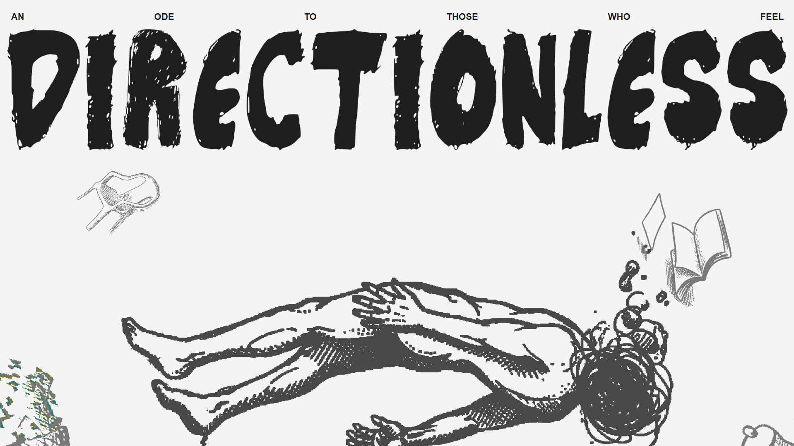
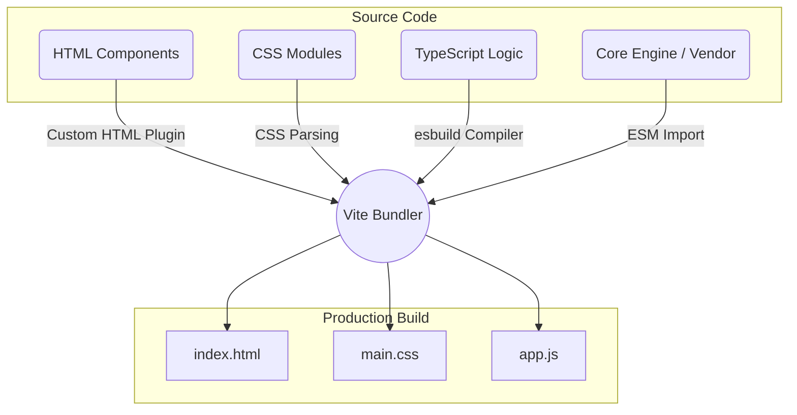

<div align="center">
  

  # AC-DC Directionless Experience

  *An ode to those who feel directionless. A high-performance, visually stunning web experience engineered with modern tooling and modular architecture.*

  [](LICENSE)
  []()
  []()
  []()
  []()
</div>

<br />

## 📖 Project Overview

This project is a highly optimized, modularized web experience. Originally a monolithic architecture, the codebase has been aggressively refactored into a scalable component-based structure using a custom Vite HTML plugin, segmented CSS modules, and isolated third-party engine scripts. It utilizes high-performance animation libraries (GSAP, Lenis) alongside robust modular TypeScript logic.

---

## ✨ Key Features

| Feature | Description | Technology Stack |
| :--- | :--- | :--- |
| **Component HTML Architecture** | Monolithic HTML securely split into logical partials, composed at build-time. | `Vite Custom Plugin`, `HTML5` |
| **High-Performance Animations** | Smooth, buttery 60fps scrolling and complex WebGL shatter effects. | `GSAP`, `Lenis Scroll` |
| **Layered CSS System** | Cleanly separated style layers (Normalize, Core, Components). | `CSS3`, `Vite` |
| **Isolated Core Engine** | Compiled third-party interactive scripts sandboxed strictly in the vendor. | `ES Modules`, `Vanilla JS` |
| **Type-Safe Application Logic** | Custom animations and DOM orchestrations strongly typed. | `TypeScript` |

---

## 🏗️ Architecture Flow

The following diagram illustrates how the modular assets compile via Vite into the final optimized production bundle.



---

## 📂 Folder Structure

The repository relies on a strictly typed, modular architecture designed for rapid iteration.

```text
├── assets/
│   └── images/              # Optimized graphical assets and webp imagery
├── components/              # HTML Partials (Injected at build time)
│   ├── hero.html
│   ├── footer.html
│   └── ...
├── js/
│   ├── directionless.ts     # Main application entry point
│   └── modules/             # Segregated TS animation controllers
├── styles/                  # Segmented CSS Architecture
│   ├── main.css             # CSS entrypoint
│   ├── normalize.css        # Resets
│   ├── webflow-core.css     # Base framework overrides
│   └── custom-components.css# Scoped UI styles
├── vendor/                  # Third-party isolated dependencies
│   ├── core-engine.js       # Core engine runtime map
│   └── engine_modules/      # Extracted individual module runtimes
├── vite.config.js           # Build configuration & Custom Plugins
└── package.json             # NPM dependencies
```

---

## 🚀 Quick Start

Ensure you have [Node.js](https://nodejs.org/) installed, then run the following commands:

1. **Install Dependencies**
   ```bash
   npm install
   ```

2. **Start the Development Server**
   ```bash
   npm run dev
   ```

3. **Build for Production**
   ```bash
   npm run build
   ```
   *The optimized assets will be exported to the `/dist` folder.*

---

## 📜 License

### AC-DC License

**Copyright (c) 2026 AC-DC Contributors.**

Permission is hereby granted, free of charge, to any person obtaining a copy of this software and associated documentation files (the "Software"), to deal in the Software without restriction, including without limitation the rights to use, copy, modify, merge, publish, distribute, sublicense, and/or sell copies of the Software, and to permit persons to whom the Software is furnished to do so, subject to the following conditions:

1. The above copyright notice and this permission notice shall be included in all copies or substantial portions of the Software.
2. The Software must never be used for evil or malicious intents.

THE SOFTWARE IS PROVIDED "AS IS", WITHOUT WARRANTY OF ANY KIND, EXPRESS OR IMPLIED, INCLUDING BUT NOT LIMITED TO THE WARRANTIES OF MERCHANTABILITY, FITNESS FOR A PARTICULAR PURPOSE AND NONINFRINGEMENT. IN NO EVENT SHALL THE AUTHORS OR COPYRIGHT HOLDERS BE LIABLE FOR ANY CLAIM, DAMAGES OR OTHER LIABILITY, WHETHER IN AN ACTION OF CONTRACT, TORT OR OTHERWISE, ARISING FROM, OUT OF OR IN CONNECTION WITH THE SOFTWARE OR THE USE OR OTHER DEALINGS IN THE SOFTWARE.
